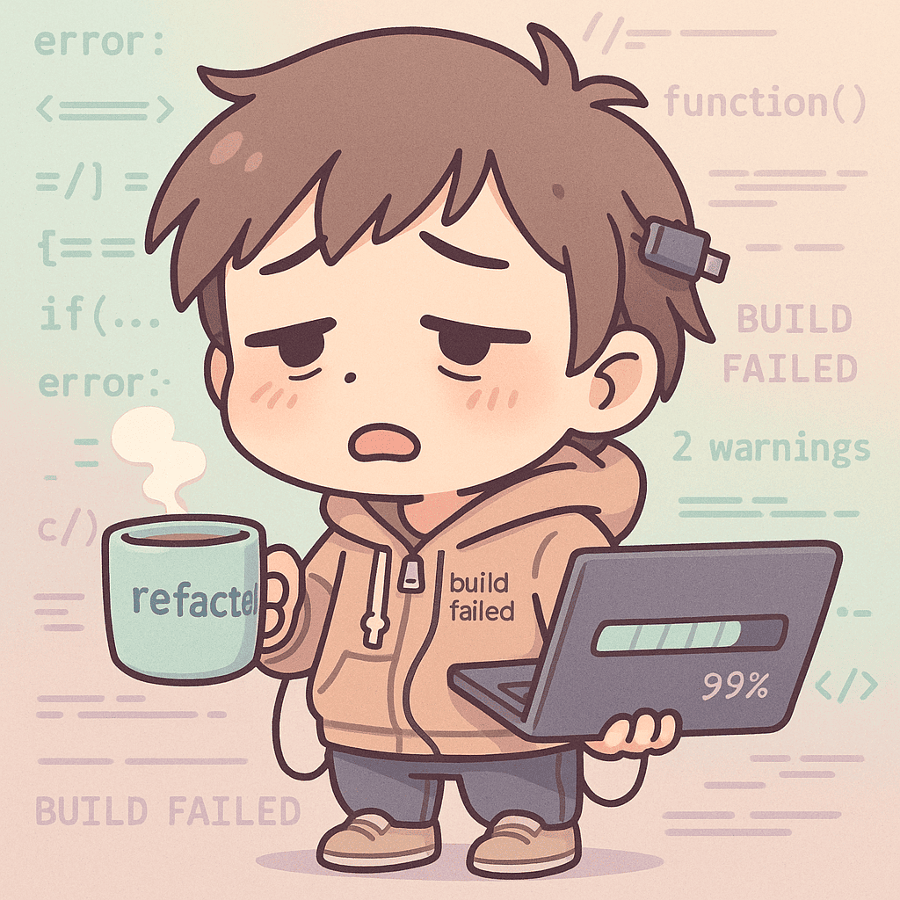

  

    
    

      <h1 style="margin:0 0 10px 0;">Android & Mobile Developer</h1>
      

        약 7년간 안드로이드 앱을 개발해 왔으며, 
        최근 3년은 <strong>시각장애인 보조기기 및 공공 R&D 과제</strong>에 집중하고 있습니다.
      

      

        <strong>이름</strong>: 방창배 (1991.10.27) 
        <strong>Email</strong>: <a href="mailto:lonmell0213@gmail.com">lonmell0213@gmail.com</a> 
        <strong>GitHub</strong>: <a href="https://github.com/lonmell" target="_blank">깃허브 링크</a>
      

    

  

  <h2>소개</h2>
  

    
단순히 기능을 만드는 것을 넘어, 실제 사용자 환경에서의 <strong>접근성(Accessibility)</strong>을 가장 중요하게 생각합니다. 「약자를 위한 기술개발 지원사업」을 통해 시각장애인 실내 이동 서비스를 상용화했으며, 공공 R&D의 까다로운 품질 기준(TTA, GS인증 등)을 충족하는 안정적인 개발을 지향합니다.

  

  <h2>기술 스택</h2>
  

    

      <strong>Language</strong>
      Java(Main), Kotlin, Dart(Flutter), PHP
    

    

      <strong>Mobile Framework</strong>
      Android Native (Camera2, View, Service), BLE/iBeacon 연동, Retrofit, FCM, TTS, 음성인식
    

    

      <strong>Database & Tools</strong>
      MySQL, MariaDB, Git/GitHub, Notion, Jira
    

    

      <strong>Certification / R&D</strong>
      TTA 성능평가, GS인증, ISO9001 대응 역량
    

  

  <h2>대표 프로젝트</h2>
  
  

    <h3>1. HatioEye – 시각장애인 보조·실내 내비게이션</h3>
    
2023.05 ~ 재직 중 | 안드로이드 핵심 개발

    
    

      <a href="https://youtu.be/RvpdKi8TPu4" class="video-tag" target="_blank">KBS 뉴스 보도</a>
      <a href="https://youtu.be/JWexY0MNggE" class="video-tag" target="_blank">인천공항 시연</a>
      <a href="https://youtu.be/h5G9FrHZ0Tc" class="video-tag" target="_blank">국정감사 시연</a>
      <a href="https://www.youtube.com/watch?v=86Rvdg7s8Kc" class="video-tag" target="_blank">복지전시회 참여</a>
    

    
<strong>주요 업무:</strong>

    <ul>
      <li>안드로이드 앱 전체 구조 설계 및 핵심 기능(Camera2, BLE 측위) 개발</li>
      <li>시각장애인 전용 제스처 메뉴 및 음성 인터랙션 설계</li>
      <li><strong>기술 문서화:</strong> 하드웨어 연동 규격서(SA) 및 프로젝트 가이드(README) 체계적 관리</li>
    </ul>
    
<strong>주요 성과:</strong> 서울특별시장 표창 수상, 조달청 혁신제품 등록, CES 2025 출품 지원

  

  

    <h3>2. 모바일 작업현황 보고 시스템</h3>
    
2022 | 단독 개발

    <ul>
      <li>공기업 현장 업무 디지털 전환을 위한 안드로이드 앱 설계 및 개발</li>
      <li>대구경북 스타트업 페스티벌 <strong>공기업 대학생 부문 수상</strong> (한국가스공사)</li>
    </ul>
  

  <h2>R&D · 공공 사업 참여 이력</h2>
  

    <ul style="font-size: 0.95rem; padding-left: 20px;">
      <li>2024 인천공항 신기술 테스트베드 공모전 선정</li>
      <li>2024 디지털인프라(SW) 종합 진단 및 개선 사업 (TTA/NIPA) 대응</li>
      <li>2024 경상북도 4차산업혁명 핵심기술개발 (비대면 시험 감독 시스템)</li>
      <li>2024 양자기술개발 지원사업 기획 참여</li>
      <li>2023 약자를 위한 기술개발 지원사업 (서울시)</li>
      <li>스마트라이프위크, 월드IT쇼 등 주요 박람회 기술 시연 및 지원</li>
    </ul>
  

